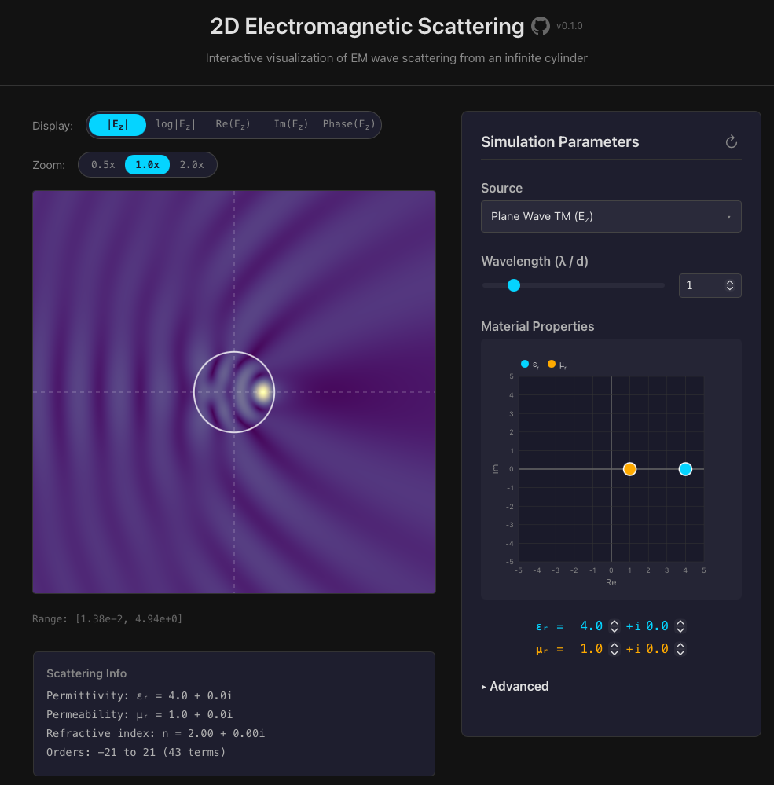

# 2D Electromagnetic Mie-Scattering Simulator



## About
This is an interactive visualization of electromagnetic scattering from an infinite dielectric cylinder. The user can change key physical parameters and see how the electromagnetic scattering solution changes in real time. The tunable values are:

- $\lambda$:   The wavelength of incident light (relative to cylinder diameter)
- $\epsilon_r$: The relative permittivity of the cylinder 
- $\mu_r$:  The relative permeability of the cylinder 
- Orientation [TM or TE]: Determines which field (Electric or Magnetic) is oriented along the cylinder axis.

## Brief Mathematical Outline

This section outlines the physical scenario presented in this application. It lays out the geometry of the problem and gives a high-level overview of the Mie theory approach for its solution. Mie theory provides an exact analytical solution for electromagnetic scattering from canonical geometries such as cylinders and spheres. This is not intended to be a complete derivation, but an eager reader could easily find such descriptions with some literature search.

### Geometry
We are interested in calculating the electromagnetic field solutions for electromagnetic sources in the presence of an infinitely long cylinder embedded in free space. The cylinder's electric and magnetic properties are determined respectively by its complex relative permittivity $\epsilon_{r}$ and magnetic permeability $\mu_{r}$, both of which the user may tune. In the exterior free space these values are $\epsilon_{r}=\mu_{r}=1$.

<p align="center">
  
</p>

The problem to be solved is as follows. Given the geometry and some radiating source, solve Maxwell's equations to determine the total electric field $\mathbf{E}$ and magnetic field $\mathbf{H}$. Under these circumstances, Maxwell's equations are:

$$
\begin{aligned}
\nabla \cdot \mathbf{E}&=0 \\
\nabla \cdot \mathbf{H}&=0 \\
\nabla \times \mathbf{E}&=i\omega\mu_r\mathbf{H} \\
\nabla \times \mathbf{H}&=-i\omega\epsilon_r\mathbf{E}
\end{aligned}
$$
where $\{\mathbf{E}, \mathbf{H}, \epsilon_r, \mu_r\}$ are functions of position $\mathbf{r}$ in the transverse plane orthogonal to the cylinder axis.

### Solution

Solving Maxwell's equations then reduces to solving the scalar Helmholtz equation in the transverse plane

$$ [\nabla^{2} + k^{2}(\mathbf{r})]\phi(\mathbf{r})=0 $$

where $k(\mathbf{r})=2\pi n(\mathbf{r})/\lambda$ is the position-dependent wavenumber, $n(\mathbf{r})=\sqrt{\epsilon_{r}\mu_{r}}$ is the local index of refraction, and $\phi(\mathbf{r})$ represents the field oriented parallel to the cylinder axis. The orientation is a toggle option in the application, where $\phi(\mathbf{r})$ is either the magnetic field $H_z$ (TE: Transverse Electric) or $E_z$ (TM: Transverse Magnetic) as indicated in the geometry figure.

The approach of Mie theory is to decompose the total field into a known source field $\phi^{src}$ and unknown scattered fields — $\phi^{sca}_E$ scattered outward and $\phi^{sca}_I$ scattered inward from the cylinder boundary.

These fields are each expanded into infinite series using the Bessel functions $J_{\nu}$ and $H_{\nu}$, which form a complete basis for solutions to the Helmholtz equation in cylindrical coordinates:

$$
\begin{aligned}
\phi_{E} &= \phi^{src}_{E} + \phi^{sca}_{E} = \sum_{\nu=-\infty}^{\infty}a_{E\nu}J_{\nu}(k_0r)e^{i\nu\theta} + b_{\nu}H_{\nu}(k_0r)e^{i\nu\theta} \\
\phi_{I} &= \phi^{src}_{I} + \phi^{sca}_{I} = \sum_{\nu=-\infty}^{\infty}a_{I\nu}H_{\nu}(k_nr)e^{i\nu\theta} +c_{\nu}J_{\nu}(k_nr)e^{i\nu\theta}
\end{aligned}
$$

Here $\phi_{E}$ is the exterior field with contributions from an exterior source and a field scattered outward from the cylinder boundary, and $\phi_{I}$ is the interior field with contributions from an interior source and the field scattered inward from the cylinder boundary. For a given source only one of the source fields $\{ \phi^{src}_E,\phi^{src}_I \}$ will be non-zero. 

The coefficients $\{a_{E\nu}, a_{I\nu}\}$ are the expansion coefficients of the source fields, which are generally known for common sources like planewaves and dipoles. Note that the exterior source expansion uses $J_\nu(k_0 r)$ for planewaves but $H_\nu(k_0 r)$ for dipole sources, reflecting the different radiation behavior of each.

Finally, the coefficients $\{b_{\nu}, c_{\nu}\}$ are determined by enforcing boundary conditions at the cylinder boundary. Once the coefficients are determined (up to a cutoff $\nu_{max}$), the fields are calculated from the series expansions. Determining these coefficients is the central effort of Mie Theory.

### Sources

This application supports three source types.

- Planewave
- Axial Electric Dipole ($\mathbf{E}=E_z \mathbf{\hat z}$)
- Transverse Electric Dipole ($\mathbf{E}=E_x \mathbf{\hat x} +E_y \mathbf{\hat y}$)

The planewave is always an exterior source. On the other hand, the dipole sources may be positioned interior *or* exterior to the cylinder. All of these configurations are supported by the app.

## For Developers

### Tech Stack

- **Frontend**: React + TypeScript + Vite. Field computations run on web worker for smooth UX.
- **Computation**: Rust compiled to WebAssembly (wasm-pack)
- **Core Math**: Custom Bessel function implementations validated against SciPy

### Prerequisites

- Node.js (v18+)
- Rust toolchain (`rustup`)
- wasm-pack (`cargo install wasm-pack`)
- Docker (optional)

### Commands

```bash
# If you just want to run the application. Must have docker installed.
make docker

# If you are developing, the following commands will be helpful
make setup # Initial setup (install dependencies, configure git hooks)
make run # Run development server
make build # Build for production

make test
make format
```

### Project Structure

```
├── src/                  # React frontend
├── scattering-core/      # Rust WASM library
│   ├── src/
│   │   ├── bessel.rs     # Bessel/Hankel functions
│   │   ├── scattering.rs # Mie coefficients
│   │   └── field.rs      # Field computation
│   └── tests/            # Validation tests
└── Makefile              # Build commands
```
